**UNIVERSIDAD PERUANA DE CIENCIAS APLICADAS**

Machine Learning - CC57

Trabajo Final

**INTEGRANTES**

Benites Diaz, Juan Alejandro			u202010449

Tumbalobos Cubas, Kevin William		u201922518

Guevara Dominguez, Sebastian Aaron 		u20181h207

**SECCIÓN**

CC72

**DOCENTE**

Canaval Sanchez, Luis Martin

**CICLO 2023-02**

` `**INTRODUCCIÓN**

El desarrollo de sistemas multiagentes es una rama fascinante de la inteligencia artificial que simula la interacción de múltiples agentes autónomos dentro de un entorno. En este proyecto, se propone la creación de un sistema multiagentes que simula la interacción de Pokémon en un mundo abierto. Los Pokémon, criaturas de diferentes tipos como fuego, agua, eléctrico, entre otros, se distribuyen en un entorno simulado y se enfrentan entre sí siguiendo reglas basadas en sus ventajas y desventajas inherentes. Este proyecto tiene como objetivo proporcionar una comprensión profunda de cómo los agentes autónomos pueden interactuar y competir dentro de un entorno complejo.

**Objetivo:** El objetivo principal de este proyecto es simular un ecosistema dinámico donde los Pokémon interactúan y se enfrentan, determinando un ganador basado en una tabla de probabilidades que refleja las fortalezas y debilidades de sus tipos. Esta simulación debe ser capaz de manejar una gran cantidad de agentes, comenzando con hasta 4000 Pokémon, ajustándose según el rendimiento del sistema.

**Metodología:** La implementación se lleva a cabo utilizando el lenguaje de programación Java. La estructura del proyecto se organiza en varios archivos y directorios que incluyen la configuración del entorno de desarrollo y el código fuente que define las funcionalidades principales del sistema. Los Pokémon se distribuyen en el mundo según un criterio definido por el equipo, y se enfrentan utilizando un sistema de batalla que considera las probabilidades de victoria basadas en las ventajas de tipo.

**Consideraciones de rendimiento:** Se ha considerado el rendimiento al definir el número inicial de Pokémon. Aunque se propone iniciar con 4000 Pokémon, este número puede ajustarse según las limitaciones de rendimiento del sistema.

**Desarrollo:**

Para empezar, en el tenemos 3 archivos principales:

El primero y principal es el **MainContainer.java**, este archivo configura y lanza el entorno principal para poder realizar lo que es la simulación de los agentes. En el, cabe resaltar la función main que inicia la instancia de JADE Runtime, crea un contenedor para los agentes, lanza también lanza el agente “WorldGUI” que probablemente maneja la interfaz gráfica del mundo, y también crear y lanza al mismo tiempo múltiple agentes “PokemonAgent” con posiciones y tipos aleatorios.

A continuación, adjuntamos la imagen del código:

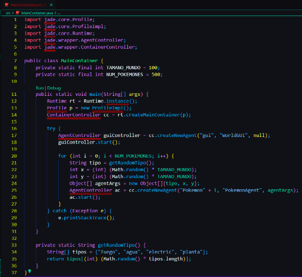

Después, tenemos el archivo  **PokemonAgent.java** , este archivo define el comportamiento de los agentes pokemones dentro de la simulación, en el tenemos las siguientes características:

En cuanto a atributos tenemos:

- tipo
- posición
- random
- probabilidades

En cuanto a comportamientos tenemos:

- TrickerBehaviour: Mueve al pokemon a una nueva dirección de manera periódica
- CycleBehaviour: Recibe mensajes de batalla y maneja la lógica de batalla

Además tenemos el componente de inicialización, este configura las probabilidades de victoria para cada tipo de Pokemon en un bloque estático y también inicializa el agente con su tipo y posición recibidos como argumentos.

A continuación se adjunta la imagen del código:

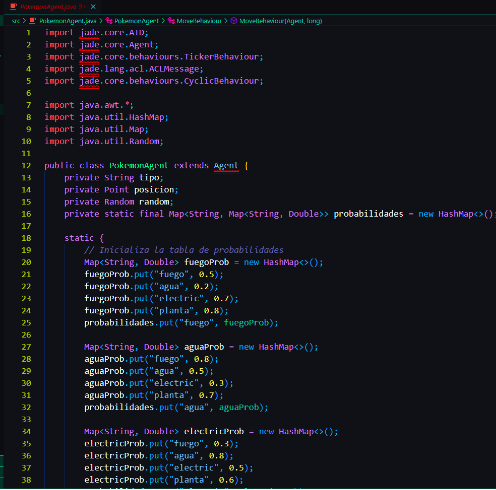

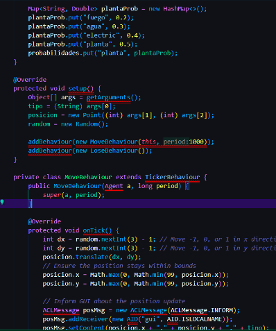

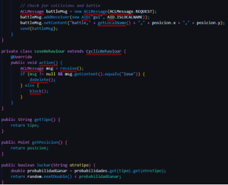

Finalmente tenemos el archivo **WorldGUI.java** , archivo encargado de la interfaz gráfica del mundo donde se simula los agentes pokemon.

En el se destaca la clase de WorldGUI, donde se implementa la interfaz gráfica utilizando Swing y tienen un WorldPanel que dibuja el estado actual del mundo, además, se tiene la clase WorldPanel que mantiene y actualiza las posiciones y tipos de los pokemones, tambióen usa diferentes colores por cada tipo de pokemon y muestra estadísticas como el número de pokemons restantes, batallas y pokemones eliminados.

A continuación, se muestra el código:

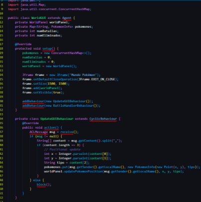

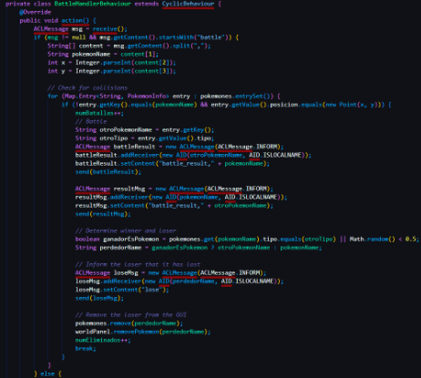

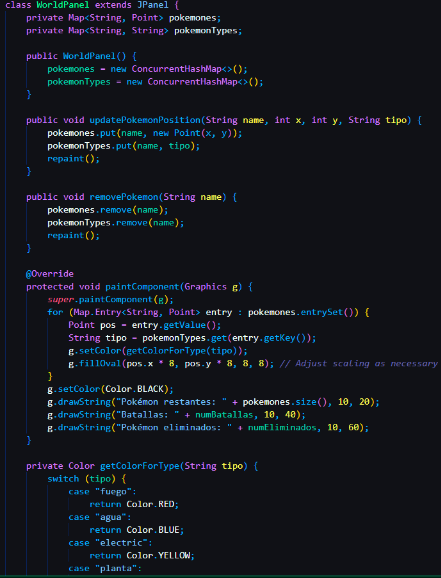

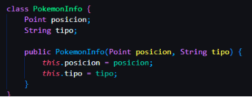

Además , se nos pidió la tabla de probabilidades, por lo que a continuación adjuntamos la tabla de probabilidades de cada pokemon:

**Tabla de probabilidades:**

|**Tipo Atacante**|**Tipo Defensor**|**Probabilidad**|
| :- | :- | :- |
|fuego|fuego|0\.5|
|fuego|agua|0\.2|
|fuego|electric|0\.4|
|fuego|planta|0\.8|
|fuego|roca|0\.2|
|fuego|psiquico|0\.6|
|fuego|ghost|0\.4|
|fuego|lucha|0\.6|
|fuego|bicho|0\.7|
|agua|fuego|0\.8|
|agua|agua|0\.5|
|agua|electric|0\.3|
|agua|planta|0\.4|
|agua|roca|0\.7|
|agua|psiquico|0\.5|
|agua|ghost|0\.5|
|agua|lucha|0\.6|
|agua|bicho|0\.5|
|electric|fuego|0\.3|
|electric|agua|0\.8|
|electric|electric|0\.5|
|electric|planta|0\.6|
|electric|roca|0\.7|
|electric|psiquico|0\.5|
|electric|ghost|0\.4|
|electric|lucha|0\.4|
|electric|bicho|0\.6|
|planta|fuego|0\.2|
|planta|agua|0\.3|
|planta|electric|0\.4|
|planta|planta|0\.5|
|planta|roca|0\.7|
|planta|psiquico|0\.3|
|planta|ghost|0\.6|
|planta|lucha|0\.5|
|planta|bicho|0\.7|
|roca|fuego|0\.6|
|roca|agua|0\.4|
|roca|electric|0\.3|
|roca|planta|0\.2|
|roca|roca|0\.5|
|roca|psiquico|0\.6|
|roca|ghost|0\.4|
|roca|lucha|0\.6|
|roca|bicho|0\.3|
|psiquico|fuego|0\.4|
|psiquico|agua|0\.6|
|psiquico|electric|0\.5|
|psiquico|planta|0\.7|
|psiquico|roca|0\.4|
|psiquico|psiquico|0\.5|
|psiquico|ghost|0\.3|
|psiquico|lucha|0\.7|
|psiquico|bicho|0\.4|
|ghost|fuego|0\.7|
|ghost|agua|0\.5|
|ghost|electric|0\.6|
|ghost|planta|0\.4|
|ghost|roca|0\.6|
|ghost|psiquico|0\.7|
|ghost|ghost|0\.5|
|ghost|lucha|0\.4|
|ghost|bicho|0\.5|
|lucha|fuego|0\.5|
|lucha|agua|0\.4|
|lucha|electric|0\.6|
|lucha|planta|0\.5|
|lucha|roca|0\.7|
|lucha|psiquico|0\.3|
|lucha|ghost|0\.4|
|lucha|lucha|0\.5|
|lucha|bicho|0\.6|
|bicho|fuego|0\.3|
|bicho|agua|0\.5|
|bicho|electric|0\.4|
|bicho|planta|0\.7|
|bicho|roca|0\.4|
|bicho|psiquico|0\.6|
|bicho|ghost|0\.5|
|bicho|lucha|0\.6|
|bicho|bicho|0\.5|

**Control de versiones:**

**V1**

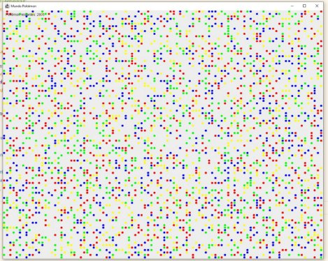

En la primera versión se lograron añadir únicamente 4 clases, representadas en la interfaz gráfica como puntos de colores.

**V2**

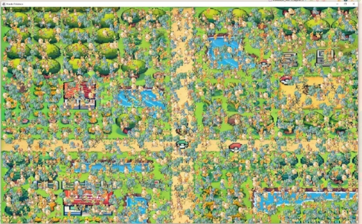

En la segunda versión se implementó la carga de imágenes para cada una de las clases para los agentes, además de un fondo para la interfaz gráfica. 

**Versión final**

Finalmente, se mostrará una imagen del resultado final de proyecto:

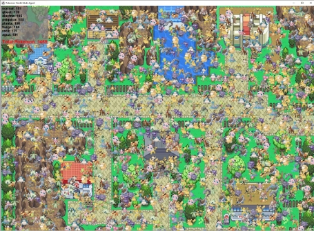

**Conclusiones**

El proyecto logró desarrollar un sistema multiagentes funcional que simula con éxito la interacción de Pokémon en un entorno abierto, utilizando Java para crear agentes autónomos con comportamientos basados en probabilidades. La simulación maneja eficientemente la diversidad de tipos de Pokémon y sus interacciones. Además, demostró ser escalable, iniciando con hasta 4000 Pokémon ajustados según el rendimiento. Este sistema no solo proporciona una herramienta educativa y experimental valiosa, sino que también sirve como base para futuras investigaciones en simulaciones de entornos complejos.

**Repositorio de Github:**

[**https://github.com/MrPepePollo/TF_TopicosCC**](https://github.com/MrPepePollo/TF_TopicosCC)

